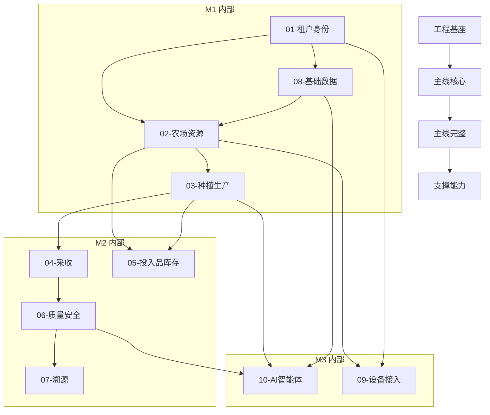

# 开发路线图（Roadmap）

> 里程碑规划定义项目分几个阶段交付，每阶段包含哪些功能域及验收标准。
> 本文档是「宪法之下、spec 之上」的规划层，新增/调整功能域必须先改本文档。

---

## 功能域总览

| 编号 | 功能域 | 说明 | 所属里程碑 |
|------|--------|------|------------|
| 01 | 租户与身份 | 注册/登录/多租户/权限 | M1 |
| 02 | 农场资源 | 农场/地块(地图多边形)/批次管理 | M1 |
| 03 | 种植生产 | 农事记录(批量)/物候期/种植计划 | M1+M2 |
| 04 | 采收与产后 | 采摘批次/产量 | M2 |
| 05 | 投入品库存 | 农资档案/出入库/库存流水 | M2 |
| 06 | 质量安全 | 检测记录/合格证(模板+打印+溯源) | M2 |
| 07 | 溯源展示 | 公开溯源页 | M2 |
| 08 | 基础数据 | 字典/品种/政策 | M1 |
| 09 | 设备接入 | 物联网第三方对接/设备台账/控制 | M3 |
| 10 | AI 智能体 | Agent 对话/双层知识库/物候期推荐 | M3 |

---

## M0 基座（项目骨架）

- **目标**：前后端 + 渲染服务骨架 + CI/CD 跑通，开发环境就绪
- **功能域**：无业务域，纯工程搭建
- **产出物**：
  - [ ] pnpm monorepo 初始化
  - [ ] `apps/web` + `apps/admin` 骨架（Vue3 + Vite + TS）
  - [ ] `server/` 骨架（Java / Spring Boot 3.x / JDK 21）
  - [ ] `services/render` 渲染服务骨架（Node + Playwright，HTML/CSS → 图片）
  - [ ] `packages/shared` 共享包
  - [ ] `.github/workflows/ci.yml`（lint + typecheck + build）
  - [ ] `deploy/docker-compose.yml`（本地开发环境：MySQL + Redis + 向量库 + 渲染服务）
- **验收**：`pnpm dev` 前后端与渲染服务可访问 hello world

---

## M1 主线核心（最小闭环）

- **目标**：核心业务流程可跑通——从注册到建农场到记农事
- **功能域**：01 租户身份、08 基础数据、02 农场资源、03 种植生产（农事）
- **端到端验收**：注册 → 登录 → 建农场 → 划地块(地图多边形) → 建批次 → 记一条农事

### 域 01 — 租户与身份
| 功能 | AC 数 | 说明 |
|------|-------|------|
| 注册 | 3 | 手机号验证码注册 |
| 登录 | 3 | 验证码登录 + JWT |
| 多租户隔离 | 2 | 单库 + tenant_id 列隔离 |
| 基础权限 | 2 | 角色：管理员/技术员/操作员 |

### 域 08 — 基础数据
| 功能 | AC 数 | 说明 |
|------|-------|------|
| 字典管理 | 2 | 平台级字典 CRUD |
| 品种管理 | 2 | 农作物品种库 |
| 农资目录 | 2 | 农药/化肥目录 |

### 域 02 — 农场资源
| 功能 | AC 数 | 说明 |
|------|-------|------|
| 农场管理 | 3 | 创建/编辑/查看农场 |
| 地块管理 | 5 | 地图多边形地块：Leaflet 绘制、GeoJSON 存储、面积由前端地图 SDK 计算、update 轮廓触发重算 + 服务端校验多边形合法性 |
| 批次管理 | 3 | 种植/养殖批次 |

### 域 03 — 种植生产（M1 部分）
| 功能 | AC 数 | 说明 |
|------|-------|------|
| 农事记录 | 4 | 在地块/批次上记录农事，支持批量（作业单+明细主从） |
| 农事列表 | 3 | 按地块/批次/时间筛选 |

---

## M2 主线完整（产到销到溯源全链路）

- **目标**：产到销到溯源全链路，种植计划闭环
- **功能域**：04 采收、05 投入品库存、06 质量安全、07 溯源、03 扩展（种植计划）
- **端到端验收**：种植计划 → 投入品预估 → 库存出入库 → 采收 → 检测 → 合格证打印 → 扫码溯源

### 域 03 扩展 — 种植计划
| 功能 | AC 数 | 说明 |
|------|-------|------|
| 种植计划 | 4 | 地块×作物×时段排产 |
| 投入品预估 | 3 | 计划生成农资用量预估，联动 05 库存 |
| 成本预算 | 3 | 农资单价×用量 + 人工/机械 |

### 域 04 — 采收与产后
| 功能 | AC 数 | 说明 |
|------|-------|------|
| 采收记录 | 3 | 采摘批次/产量 |
| 产量统计 | 2 | 按地块/批次/作物统计 |

### 域 05 — 投入品库存
| 功能 | AC 数 | 说明 |
|------|-------|------|
| 农资档案 | 2 | 农资目录/效期 |
| 入库 | 3 | 采购/退库入库流水 |
| 出库 | 3 | 领用/调拨出库流水 |
| 库存查询 | 2 | 实时库存/批次效期 |

### 域 06 — 质量安全
| 功能 | AC 数 | 说明 |
|------|-------|------|
| 检测记录 | 2 | 农残检测记录 |
| 模板设计器 | 5 | 可视化拖拽设计合格证模板（HTML/CSS，纸张宽高+彩色标记） |
| 证书生成 | 4 | 一证一码、服务端渲染 PNG 下发打印 |
| 二维码溯源 | 3 | 扫码跳公开溯源页 |

### 域 07 — 溯源展示
| 功能 | AC 数 | 说明 |
|------|-------|------|
| 公开溯源页 | 3 | 无鉴权，按溯源码展示产地/地块/农事/检测 |

---

## M3 支撑能力

- **目标**：设备接入、AI 智能体、报表统计、消息通知
- **功能域**：09 设备接入、10 AI 智能体、报表统计、消息通知

### 域 09 — 设备接入
| 功能 | AC 数 | 说明 |
|------|-------|------|
| 物联网基地 | 2 | 农场→物联网基地映射表 |
| 授权对接 | 3 | 第三方系统 OAuth2/AppKey 授权对接 |
| 设备台账 | 2 | 传感器/农机档案 |
| 数据转发 | 3 | 服务端代理转发第三方服务，客户端渲染设备 |
| 设备控制 | 3 | 控制指令下发（授权+审计+幂等） |

### 域 10 — AI 智能体
| 功能 | AC 数 | 说明 |
|------|-------|------|
| Agent 对话 | 4 | 问答分析需求 + 工具调用（一句话完成农事/打印合格证） |
| 系统知识库 | 2 | 平台级共享知识库 |
| 农场专有知识库 | 3 | 租户级知识库（隔离） |
| 物候期推荐 | 3 | 种植计划 × 作物物候期知识库 → 推送种养建议 |

---

## 依赖关系

- **01 租户身份**：所有域的基础依赖
- **08 基础数据**：支撑件的字典/品种，多数域需要
- **02 农场资源**：核心实体，03 的生产操作、09 的设备绑定都依赖它
- **09 设备接入**：依赖 02（农场）与 01（授权），独立于 03-07 业务流
- **10 AI 智能体**：横跨 03（农事/物候期）、06（合格证）、05（库存）的横向能力

---

## 版本

| 版本 | 日期 | 变更 |
|------|------|------|
| v0.1 | 2026-08-21 | 初始草案，功能域划分待需求头脑风暴确认 |
| v0.2 | 2026-08-21 | 头脑风暴定稿：功能域 8→10（新增 09 设备接入、10 AI 智能体），02/03/05/06 范围细化，技术栈落位（Java/Spring Boot + Node 渲染服务 + MySQL + AI Agent） |
