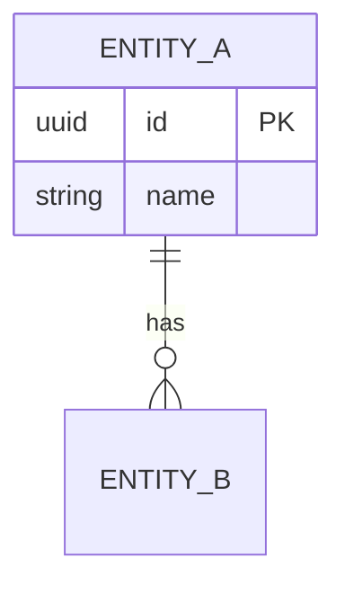

# <编号>-<功能域名称> — 功能规范

> 版本：v1.0 | 最后更新：YYYY-MM-DD | 宪法依据：constitution.md 第X章
> 所属里程碑：M1 | 对应 roadmap：docs/roadmap.md

## 变更历史

| 版本 | 日期 | 变更说明 |
|------|------|----------|
| v1.0 | YYYY-MM-DD | 初始版本 |

---

## 1. 概述

### 1.1 功能简述
一句话描述这个功能要解决什么问题。

### 1.2 用户故事
- 作为 <角色>，我想要 <功能>，以便 <价值>

---

## 2. 验收标准（AC）

### AC-<域编号>-001: <标准名称>
- **Given** <前置条件>
- **When** <动作>
- **Then** <预期结果>

### AC-<域编号>-002: <标准名称>
- **Given** <前置条件>
- **When** <动作>
- **Then** <预期结果>

---

## 3. 数据模型

### 3.1 涉及实体

| 实体 | 字段 | 类型 | 必填 | 说明 |
|------|------|------|------|------|
| | | | | |

### 3.2 ER 图（如有变更）

---

## 4. 业务流程

### 4.1 主流程
1. 步骤一
2. 步骤二
3. 步骤三

### 4.2 异常流程
| 异常场景 | 处理方式 |
|----------|----------|
| | |

---

## 5. 待确认

| 编号 | 问题 | 状态 |
|------|------|------|
| Q-001 | ... | 待确认 |